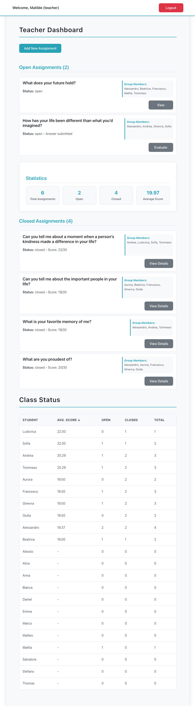

# Exam 2: "Compiti"
## Student: s347489 OSTINELLI LUCA

## React Client Application Routes

- Route `/`: Redirects authenticated users to appropriate dashboard based on role (teacher → `/teacher`, student → `/student`)
- Route `/login`: Login page with centered authentication form
- Route `/teacher`: Teacher's main dashboard showing assignments and class statistics  
- Route `/student`: Student's personal dashboard with assigned tasks and progress
- Route `/teacher/create`: Form for creating new assignments and selecting group members
- Route `/assignment/:id`: Detailed view of a specific assignment (view/edit for students, evaluation for teachers)

## API Server

- POST `/api/login`
  - Request body: `{ name: string, password: string }`
  - Response body (success): `{ id, name, role }`
  - Response body (failure): `{ error: "Login failed" }` or specific error message

- POST `/api/logout`
  - No parameters
  - Response body: `204 No Content`

- GET `/api/sessions/current`
  - No parameters
  - Response body: `{ id, name, role }` if logged in, or `401 Unauthorized` with `{ error: "Not authenticated" }`

- GET `/api/assignments` (for teacher)
  - Requires session and teacher role
  - Response body: array of assignments created by the teacher with group member details

- GET `/api/assignments` (for student)
  - Requires session and student role  
  - Response body: array of assignments assigned to the student (group member) with teacher info

- POST `/api/assignments`
  - Requires session and teacher role
  - Request body: `{ question: string }`
  - Response body: `{ id: number }` newly created assignment ID
  - Returns 201 status code on success, or error if validation fails

- POST `/api/assignments/:id/group`
  - Requires session and teacher role
  - Request body: `{ studentIds: array of student IDs }`
  - Response body: `204 No Content`, or error if validation fails

- PUT `/api/assignments/:id/answer`
  - Requires session and student role
  - Request body: `{ answer: string }`
  - Response body: updated assignment object, or error if not in group or assignment closed

- PUT `/api/assignments/:id/evaluate` 
  - Requires session and teacher role
  - Request body: `{ score: number (0-30), expectedAnswer: string }`
  - Response body: updated assignment object, automatically closes assignment

- GET `/api/assignments/:id`
  - Requires authentication
  - Response body: full assignment data if requester is creator or group member

- GET `/api/student/average`
  - Requires session and student role
  - Response body: `{ average: number }` weighted average score (rounded to 2 decimals)

- GET `/api/teacher/class-status`
  - Requires session and teacher role
  - Response body: array of per-student statistics with weighted averages

- GET `/api/students`
  - Requires session and teacher role
  - Response body: array of all students for assignment creation

- POST `/api/students/eligible`
  - Requires session and teacher role
  - Request body: `{ selectedIds: array of student IDs }`
  - Response body: eligible students (respects collaboration limits of max 2 times)

## Database Tables

- Table `Users` – stores all system users (students and teachers). Fields:
  - `id` (INTEGER, PK): unique identifier
  - `name` (TEXT, UNIQUE): login name
  - `role` (TEXT): must be either 'student' or 'teacher'
  - `passwordHash` (TEXT): hashed + salted password

- Table `Assignments` – stores all assignments created by teachers. Fields:
  - `id` (INTEGER, PK)
  - `teacherId` (INTEGER, FK to Users.id)
  - `question` (TEXT): the assignment question
  - `createdAt` (DATETIME): when the assignment was posted
  - `answer` (TEXT or NULL): the response submitted by students
  - `submittedAt` (DATETIME or NULL): when the answer was submitted
  - `score` (INTEGER or NULL): assigned score, from 0 to 30
  - `evaluatedAt` (DATETIME or NULL): when the teacher evaluated it
  - `status` (TEXT): 'open' or 'closed' (automatically managed based on scoring)

- Table `GroupMembers` – links students to assignments (many-to-many). Fields:
  - `assignmentId` (INTEGER, FK to Assignments.id)
  - `studentId` (INTEGER, FK to Users.id)
  - Composite PK on (assignmentId, studentId)

## Main React Components

- `TeacherDashboard` (in `TeacherDashboard.jsx`): Main teacher interface with assignment management, summary statistics with weighted averages, and sortable class status table showing student progress including total assignments
- `StudentDashboard` (in `StudentDashboard.jsx`): Student's personal dashboard with task organization by status, progress tracking, and weighted average display
- `CreateAssignment` (in `CreateAssignment.jsx`): Assignment creation form with intelligent student selection and collaboration limit enforcement  
- `AssignmentView` (in `AssignmentView.jsx`): Detailed assignment interface for viewing, answering (students), and evaluating (teachers)
- `LoginPage` (in `LoginPage.jsx`): Centered authentication form with modern responsive styling
- `Navigation` (in `Navigation.jsx`): Responsive navigation bar with role-based menu items
- `AuthContext` (in `AuthContext.jsx`): React context for authentication state management across the app

## Screenshot

## Users Credentials

| Username | Password | Role |
|----------|----------|------|
| Matilde | password | Teacher |
| Lorenzo | password | Teacher |
| Vittoria | password | Teacher |
| Alessandro | password | Student |
| Alessio | password | Student |
| Alice | password | Student |
| Andrea | password | Student |
| Anna | password | Student |
| Aurora | password | Student |
| Beatrice | password | Student |
| Bianca | password | Student |
| Daniel | password | Student |
| Emma | password | Student |
| Francesco | password | Student |
| Ginevra | password | Student |
| Giulia | password | Student |
| Ludovica | password | Student |
| Marco | password | Student |
| Matteo | password | Student |
| Mattia | password | Student |
| Salvatore | password | Student |
| Sofia | password | Student |
| Stefano | password | Student |
| Thomas | password | Student |
| Tommaso | password | Student |
