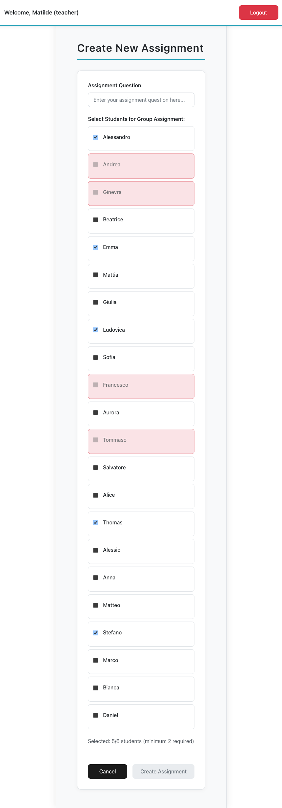

[](https://classroom.github.com/a/F9jR7G97)
# Exam 2: "Compiti"
## Student: s347489 OSTINELLI LUCA

## React Client Application Routes

- Route `/`: Redirects authenticated users to appropriate dashboard based on role (teacher → `/teacher`, student → `/student`)
- Route `/login`: Login page with centered authentication form
- Route `/teacher`: Teacher's main dashboard showing assignments and class statistics  
- Route `/student`: Student's personal dashboard with assigned tasks and progress
- Route `/teacher/create`: Form for creating new assignments and selecting group members
- Route `/assignment/:id`: Detailed view of a specific assignment (view/edit for students, evaluation for teachers)

## API Server

### __User Authentication__

URL: `/api/login`

HTTP Method: POST

Description: Authenticate user using username and password.

Request body:
```
{
  "name": "Matilde",
  "password": "password"
}
```

Response: `200 OK` (success) or `401 Unauthorized` (invalid credentials).

Response body:
```
{
  "id": 1,
  "name": "Matilde",
  "role": "teacher"
}
```

### __User Logout__

URL: `/api/logout`

HTTP Method: POST

Description: Log out the current authenticated user and destroy session.

Request body: None

Response: `204 No Content` (success) or `500 Internal Server Error` (generic error).

### __Check Current Session__

URL: `/api/sessions/current`

HTTP Method: GET

Description: Check if user is authenticated and return current user info.

Response: `200 OK` (authenticated) or `401 Unauthorized` (not authenticated).

Response body:
```
{
  "id": 1,
  "name": "Matilde",
  "role": "teacher"
}
```

### __Get All Assignments (Teacher)__

URL: `/api/assignments`

HTTP Method: GET

Description: Get all assignments created by the authenticated teacher with group member details.

Authentication: Requires session and teacher role.

Response: `200 OK` (success) or `403 Forbidden` (not teacher) or `500 Internal Server Error` (generic error).

Response body:
```
[
  {
    "id": 1,
    "question": "Can you tell me about the important people in your life?",
    "createdAt": "2025-03-05T00:00:00",
    "answer": "My parents and my sister...",
    "submittedAt": "2025-03-22T00:00:00",
    "score": 19,
    "evaluatedAt": "2025-06-27T00:00:00",
    "status": "closed",
    "groupMembers": [
      { "id": 6, "name": "Ginevra" },
      { "id": 7, "name": "Beatrice" }
    ]
  }
]
```

### __Get All Assignments (Student)__

URL: `/api/assignments`

HTTP Method: GET

Description: Get all assignments assigned to the authenticated student with teacher info.

Authentication: Requires session and student role.

Response: `200 OK` (success) or `403 Forbidden` (not student) or `500 Internal Server Error` (generic error).

Response body:
```
[
  {
    "id": 1,
    "teacherId": 1,
    "teacherName": "Matilde",
    "question": "Can you tell me about the important people in your life?",
    "createdAt": "2025-03-05T00:00:00",
    "answer": "My parents and my sister...",
    "submittedAt": "2025-03-22T00:00:00",
    "score": 19,
    "evaluatedAt": "2025-06-27T00:00:00",
    "status": "closed",
    "groupMembers": [
      { "id": 6, "name": "Ginevra" },
      { "id": 7, "name": "Beatrice" }
    ]
  }
]
```

### __Create New Assignment__

URL: `/api/assignments`

HTTP Method: POST

Description: Create a new assignment with the given question.

Authentication: Requires session and teacher role.

Request body:
```
{
  "question": "What are your career aspirations?"
}
```

Response: `201 Created` (success) or `400 Bad Request` (validation error) or `403 Forbidden` (not teacher) or `500 Internal Server Error` (generic error).

Response body:
```
{
  "id": 15
}
```

### __Assign Group to Assignment__

URL: `/api/assignments/<id>/group`

HTTP Method: POST

Description: Assign a group of students to an existing assignment.

Authentication: Requires session and teacher role.

Request body:
```
{
  "studentIds": [4, 5, 6]
}
```

Response: `204 No Content` (success) or `404 Not Found` (assignment not found) or `403 Forbidden` (not teacher or not owner) or `500 Internal Server Error` (generic error).

### __Submit Assignment Answer__

URL: `/api/assignments/<id>/answer`

HTTP Method: PUT

Description: Submit or update the answer for an assignment (group collaboration).

Authentication: Requires session and student role.

Request body:
```
{
  "answer": "I aspire to become a software engineer and work on innovative projects that make a positive impact."
}
```

Response: `200 OK` (success) or `403 Forbidden` (not in group or assignment closed) or `404 Not Found` (assignment not found) or `500 Internal Server Error` (generic error).

Response body:
```
{
  "id": 15,
  "teacherId": 1,
  "question": "What are your career aspirations?",
  "createdAt": "2025-07-04T10:30:00",
  "answer": "I aspire to become a software engineer...",
  "submittedAt": "2025-07-04T14:22:00",
  "score": null,
  "evaluatedAt": null,
  "status": "open",
  "groupMembers": [
    { "id": 4, "name": "Alessandro" },
    { "id": 5, "name": "Andrea" }
  ]
}
```

### __Evaluate Assignment__

URL: `/api/assignments/<id>/evaluate`

HTTP Method: PUT

Description: Evaluate an assignment by assigning a score and expected answer. Automatically closes the assignment.

Authentication: Requires session and teacher role.

Request body:
```
{
  "score": 25,
  "expectedAnswer": "Students should demonstrate clear career goals and understanding of their chosen field."
}
```

Response: `200 OK` (success) or `403 Forbidden` (not teacher or not owner) or `404 Not Found` (assignment not found) or `500 Internal Server Error` (generic error).

Response body:
```
{
  "id": 15,
  "teacherId": 1,
  "question": "What are your career aspirations?",
  "createdAt": "2025-07-04T10:30:00",
  "answer": "I aspire to become a software engineer...",
  "submittedAt": "2025-07-04T14:22:00",
  "score": 25,
  "evaluatedAt": "2025-07-04T16:45:00",
  "status": "closed",
  "groupMembers": [
    { "id": 4, "name": "Alessandro" },
    { "id": 5, "name": "Andrea" }
  ]
}
```

### __Get Single Assignment__

URL: `/api/assignments/<id>`

HTTP Method: GET

Description: Get detailed information about a specific assignment.

Authentication: Requires authentication. Only assignment creator or group members can access.

Response: `200 OK` (success) or `403 Forbidden` (not authorized to view) or `404 Not Found` (assignment not found) or `500 Internal Server Error` (generic error).

Response body:
```
{
  "id": 1,
  "teacherId": 1,
  "teacherName": "Matilde",
  "question": "Can you tell me about the important people in your life?",
  "createdAt": "2025-03-05T00:00:00",
  "answer": "My parents and my sister have always been my biggest support...",
  "submittedAt": "2025-03-22T00:00:00",
  "score": 19,
  "evaluatedAt": "2025-06-27T00:00:00",
  "status": "closed",
  "groupMembers": [
    { "id": 6, "name": "Ginevra" },
    { "id": 7, "name": "Beatrice" },
    { "id": 10, "name": "Giulia" },
    { "id": 13, "name": "Francesco" },
    { "id": 14, "name": "Aurora" }
  ]
}
```

### __Get Student Average Score__

URL: `/api/student/average`

HTTP Method: GET

Description: Get the weighted average score for the authenticated student.

Authentication: Requires session and student role.

Response: `200 OK` (success) or `403 Forbidden` (not student) or `500 Internal Server Error` (generic error).

Response body:
```
{
  "average": 22.75
}
```

### __Get Class Status for Teacher__

URL: `/api/teacher/class-status`

HTTP Method: GET

Description: Get statistics for all students in the teacher's classes, including assignment counts and weighted averages.

Authentication: Requires session and teacher role.

Response: `200 OK` (success) or `403 Forbidden` (not teacher) or `500 Internal Server Error` (generic error).

Response body:
```
[
  {
    "id": 4,
    "name": "Alessandro",
    "openAssignments": 2,
    "closedAssignments": 3,
    "totalAssignments": 5,
    "avgScore": 24.33
  },
  {
    "id": 5,
    "name": "Andrea",
    "openAssignments": 1,
    "closedAssignments": 4,
    "totalAssignments": 5,
    "avgScore": 21.25
  }
]
```

### __Get All Students__

URL: `/api/students`

HTTP Method: GET

Description: Get list of all students for assignment creation.

Authentication: Requires session and teacher role.

Response: `200 OK` (success) or `403 Forbidden` (not teacher) or `500 Internal Server Error` (generic error).

Response body:
```
[
  { "id": 4, "name": "Alessandro" },
  { "id": 5, "name": "Andrea" },
  { "id": 6, "name": "Alice" },
  { "id": 7, "name": "Anna" }
]
```

### __Get Eligible Students__

URL: `/api/students/eligible`

HTTP Method: POST

Description: Get list of students eligible to be added to a group, respecting collaboration limits (max 2 times with same teacher).

Authentication: Requires session and teacher role.

Request body:
```
{
  "selectedIds": [4, 5]
}
```

Response: `200 OK` (success) or `400 Bad Request` (invalid selectedIds) or `403 Forbidden` (not teacher) or `500 Internal Server Error` (generic error).

Response body:
```
[
  { "id": 6, "name": "Alice" },
  { "id": 8, "name": "Aurora" },
  { "id": 9, "name": "Beatrice" }
]
```

## Database Tables

- Table `Users` – stores all system users (students and teachers). Fields:
  - `id` (INTEGER, PK): unique identifier
  - `name` (TEXT, UNIQUE): login name
  - `role` (TEXT): must be either 'student' or 'teacher'
  - `passwordHash` (TEXT): hashed + salted password

- Table `Assignments` – stores all assignments created by teachers. Fields:
  - `id` (INTEGER, PK)
  - `teacherId` (INTEGER, FK to Users.id)
  - `question` (TEXT): the assignment question
  - `createdAt` (DATETIME): when the assignment was posted
  - `answer` (TEXT or NULL): the response submitted by students
  - `submittedAt` (DATETIME or NULL): when the answer was submitted
  - `score` (INTEGER or NULL): assigned score, from 0 to 30
  - `evaluatedAt` (DATETIME or NULL): when the teacher evaluated it
  - `status` (TEXT): 'open' or 'closed' (automatically managed based on scoring)

- Table `GroupMembers` – links students to assignments (many-to-many). Fields:
  - `assignmentId` (INTEGER, FK to Assignments.id)
  - `studentId` (INTEGER, FK to Users.id)
  - Composite PK on (assignmentId, studentId)

## Main React Components

- `TeacherDashboard` (in `TeacherDashboard.jsx`): Main teacher interface with assignment management, summary statistics with weighted averages, and sortable class status table showing student progress including total assignments
- `StudentDashboard` (in `StudentDashboard.jsx`): Student's personal dashboard with task organization by status, progress tracking, and weighted average display
- `CreateAssignment` (in `CreateAssignment.jsx`): Assignment creation form with intelligent student selection and collaboration limit enforcement  
- `AssignmentView` (in `AssignmentView.jsx`): Detailed assignment interface for viewing, answering (students), and evaluating (teachers)
- `LoginPage` (in `LoginPage.jsx`): Centered authentication form with modern responsive styling
- `Navigation` (in `Navigation.jsx`): Responsive navigation bar with role-based menu items
- `AuthContext` (in `AuthContext.jsx`): React context for authentication state management across the app

## Screenshot




## Users Credentials

| Username | Password | Role |
|----------|----------|------|
| Matilde | password | Teacher |
| Lorenzo | password | Teacher |
| Vittoria | password | Teacher |
| Alessandro | password | Student |
| Alessio | password | Student |
| Alice | password | Student |
| Andrea | password | Student |
| Anna | password | Student |
| Aurora | password | Student |
| Beatrice | password | Student |
| Bianca | password | Student |
| Daniel | password | Student |
| Emma | password | Student |
| Francesco | password | Student |
| Ginevra | password | Student |
| Giulia | password | Student |
| Ludovica | password | Student |
| Marco | password | Student |
| Matteo | password | Student |
| Mattia | password | Student |
| Salvatore | password | Student |
| Sofia | password | Student |
| Stefano | password | Student |
| Thomas | password | Student |
| Tommaso | password | Student |
